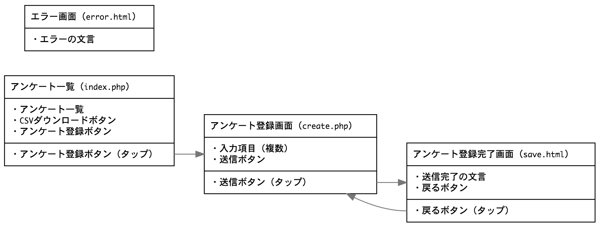

# アンケートフォーム

**作成中**

## 目的

- PHP で DB 操作する
- PHP で CSV ダウンロードする
- HTML フォームの基本的なタグを使用する（例：input, select）

## 機能概要
- アンケートに答える
- アンケート結果をダウンロードする

## 画面遷移



## 環境

環境構築手順は [PROCEDURE.md](PROCEDURE.md) を参照 。  

- Mac 10.13.6（ホストOS）
- Virtual Box 5.2.6
- CentOS 7.8.2003（ゲストOS）
- Apache HTTP Server 2.4.6
- PHP 7.4.11
  - PDO
- MariaDB 10.5.6
- JavaScript
  - jQuery
  - jQuery Validation Plugin
- CSS
  - bootstrap

## テーブル構成

### shops

| 物理名      | データ型          | 主キー | NOT NULL | 備考 |
| ---------- | ---------------- | ----- | ---------| ---- |
| id         | int(10) unsigned | YES   | YES      | AUTO INCREMENT |
| name       | varchar(50)      | -     | YES      | UNIQUE |
| is_enabled | boolean          | -     | YES      | |
| created_at | timestamp        | -     | YES      | デフォルトで現在日時を設定 |
| uodated_at | timestamp        | -     | YES      | デフォルトで現在日時を設定 |

### questionnaire

| 物理名      | データ型             | 主キー | NOT NULL | 備考 |
| ---------- | ------------------- | ----- | ---------| ---- |
| id         | int(10) unsigned    | YES   | YES      | AUTO INCREMENT |
| shop_id    | int(10) unsigned    | -     | YES      | 外部キー：shops.id |
| item       | varchar(50)         | -     | YES      | |
| flavour    | tinyint(1) unsigned | -     | YES      | 1: 悪い、3: 普通、5: 良い |
| opinion    | varchar(500)        | -     | -        | |
| created_at | timestamp           | -     | YES      | デフォルトで現在日時を設定 |
| uodated_at | timestamp           | -     | YES      | デフォルトで現在日時を設定 |

## 作業中によく使ったコマンド

### エラーログの出力と参照

PHPコード  
```
error_log("ログです。");
```

エラーログ参照
```
$ sudo tail -f /var/log/httpd/error_log
```

## お世話になったサイト

- [404エラーのページをPHPのheader関数でリダイレクトするのは間違っている](https://dev-lib.com/php-header-404-redirect/)
- [【JavaScript】【jquery】jquery.validate.jsの基本的な使い方](https://yu-ya4.hatenablog.com/entry/2015/07/04/130627)